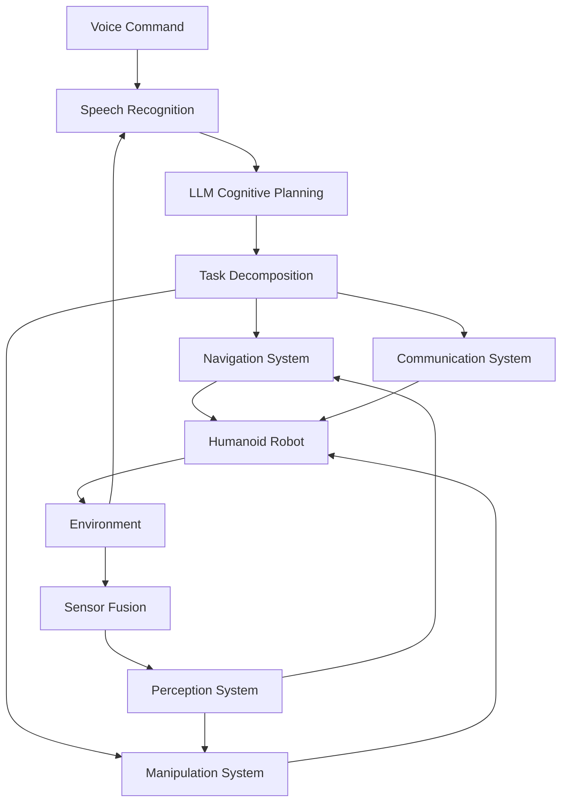

# Capstone Project: Autonomous Humanoid System

The capstone project integrates all modules to create an autonomous humanoid robot capable of receiving voice commands, understanding them cognitively, and executing appropriate actions in real-world environments.

## Learning Objectives

After completing this capstone project, you will be able to:
- Integrate all four modules into a cohesive humanoid robot system
- Implement end-to-end voice command processing from speech to action
- Deploy and test the complete autonomous humanoid system
- Evaluate system performance and identify improvement areas

## Project Overview

The capstone project combines:
- **Module 1**: ROS 2 communication and humanoid control
- **Module 2**: Digital twin simulation and sensor integration
- **Module 3**: AI perception and navigation systems
- **Module 4**: Voice-to-action and cognitive planning

The final system will accept natural language commands like "Please bring me the red cup from the kitchen" and execute them autonomously.

## System Architecture

### High-Level Architecture



### ROS 2 Package Structure

```
humanoid_robot_system/
├── voice_to_action/          # Module 4: Speech recognition
│   ├── src/
│   ├── launch/
│   └── config/
├── cognitive_planning/       # Module 4: LLM integration
│   ├── src/
│   ├── launch/
│   └── config/
├── navigation_system/        # Module 3: Isaac ROS Nav2
│   ├── src/
│   ├── launch/
│   └── config/
├── perception_system/        # Module 2: Sensor integration
│   ├── src/
│   ├── launch/
│   └── config/
├── robot_control/            # Module 1: ROS 2 nodes
│   ├── src/
│   ├── launch/
│   └── config/
└── system_integration/       # Capstone integration
    ├── src/
    ├── launch/
    └── config/
```

## Implementation Steps

### Step 1: System Integration Node

```python
#!/usr/bin/env python3

import rclpy
from rclpy.node import Node
from std_msgs.msg import String
from geometry_msgs.msg import Pose
from sensor_msgs.msg import JointState
import json
import threading
import time

class HumanoidSystemIntegrator(Node):
    def __init__(self):
        super().__init__('humanoid_system_integrator')

        # Publishers for different subsystems
        self.voice_cmd_pub = self.create_publisher(String, '/voice_commands', 10)
        self.nav_goal_pub = self.create_publisher(Pose, '/navigation/goal', 10)
        self.manip_cmd_pub = self.create_publisher(String, '/manipulation/command', 10)
        self.robot_cmd_pub = self.create_publisher(JointState, '/joint_commands', 10)

        # Subscribers for system status
        self.voice_sub = self.create_subscription(
            String, '/voice_recognition/output', self.voice_callback, 10
        )
        self.planning_sub = self.create_subscription(
            String, '/cognitive_planning/output', self.planning_callback, 10
        )
        self.nav_status_sub = self.create_subscription(
            String, '/navigation/status', self.nav_status_callback, 10
        )
        self.robot_status_sub = self.create_subscription(
            String, '/robot/status', self.robot_status_callback, 10
        )

        # System state
        self.system_state = {
            'current_task': None,
            'task_queue': [],
            'robot_status': 'idle',
            'navigation_status': 'idle',
            'voice_status': 'listening'
        }

        # Timer for system monitoring
        self.monitor_timer = self.create_timer(1.0, self.system_monitor)

    def voice_callback(self, msg):
        """Handle recognized voice commands"""
        try:
            command_data = json.loads(msg.data)
            command = command_data.get('command', '')

            self.get_logger().info(f'Processing voice command: {command}')

            # Send command to cognitive planning
            plan_msg = String()
            plan_msg.data = json.dumps({'command': command, 'context': self.get_system_context()})
            self.voice_cmd_pub.publish(plan_msg)

        except json.JSONDecodeError:
            # Handle simple text commands
            self.get_logger().info(f'Processing simple command: {msg.data}')

            # Send to planning system
            plan_msg = String()
            plan_msg.data = json.dumps({'command': msg.data, 'context': self.get_system_context()})
            self.voice_cmd_pub.publish(plan_msg)

    def planning_callback(self, msg):
        """Handle cognitive planning output"""
        try:
            plan = json.loads(msg.data)

            if plan.get('success', False):
                self.get_logger().info('Plan received, executing...')
                self.execute_plan(plan)
            else:
                self.get_logger().error(f'Planning failed: {plan.get("error", "Unknown error")}')
                self.handle_planning_failure(plan)

        except json.JSONDecodeError:
            self.get_logger().error('Invalid plan format received')

    def execute_plan(self, plan):
        """Execute the received plan"""
        self.system_state['current_task'] = plan

        for step in plan.get('steps', []):
            self.execute_step(step)

            # Wait for step completion
            self.wait_for_step_completion(step)

    def execute_step(self, step):
        """Execute a single step of the plan"""
        action = step.get('action', '')
        params = step.get('parameters', {})

        if action == 'navigate':
            self.execute_navigation_step(params)
        elif action == 'grasp':
            self.execute_grasp_step(params)
        elif action == 'place':
            self.execute_place_step(params)
        elif action == 'speak':
            self.execute_speak_step(params)
        else:
            self.get_logger().warn(f'Unknown action: {action}')

    def execute_navigation_step(self, params):
        """Execute navigation step"""
        target = params.get('target', '')

        # In a real system, this would call navigation services
        goal_msg = Pose()
        # Set goal based on target location
        self.nav_goal_pub.publish(goal_msg)

        self.get_logger().info(f'Navigating to: {target}')

    def execute_grasp_step(self, params):
        """Execute grasp step"""
        obj = params.get('object', '')

        # Publish manipulation command
        cmd_msg = String()
        cmd_msg.data = json.dumps({'action': 'grasp', 'object': obj})
        self.manip_cmd_pub.publish(cmd_msg)

        self.get_logger().info(f'Grasping object: {obj}')

    def system_monitor(self):
        """Monitor overall system status"""
        status_msg = String()
        status_msg.data = json.dumps(self.system_state)

        # Publish system status
        self.create_publisher(String, '/system/status', 10).publish(status_msg)

    def get_system_context(self):
        """Get current system context for planning"""
        return {
            'robot_location': 'current_location',  # Would come from localization
            'battery_level': 85,  # Would come from robot status
            'environment_objects': ['cup', 'book', 'phone'],  # Would come from perception
            'robot_capabilities': ['navigation', 'manipulation', 'speech']
        }

def main(args=None):
    rclpy.init(args=args)
    node = HumanoidSystemIntegrator()

    try:
        rclpy.spin(node)
    except KeyboardInterrupt:
        pass
    finally:
        node.destroy_node()
        rclpy.shutdown()

if __name__ == '__main__':
    main()
```

### Step 2: Launch File Integration

```xml
<!-- system_integration/launch/capstone_system.launch.py -->
from launch import LaunchDescription
from launch.actions import DeclareLaunchArgument
from launch.substitutions import LaunchConfiguration
from launch_ros.actions import Node

def generate_launch_description():
    return LaunchDescription([
        # Declare launch arguments
        DeclareLaunchArgument(
            'use_sim_time',
            default_value='false',
            description='Use simulation time'
        ),

        # Voice-to-action node
        Node(
            package='voice_to_action',
            executable='voice_to_action_node',
            name='voice_to_action_node',
            parameters=[
                {'use_sim_time': LaunchConfiguration('use_sim_time')}
            ],
            output='screen'
        ),

        # Cognitive planning node
        Node(
            package='cognitive_planning',
            executable='llm_planning_node',
            name='llm_planning_node',
            parameters=[
                {'use_sim_time': LaunchConfiguration('use_sim_time')}
            ],
            output='screen'
        ),

        # Navigation system
        Node(
            package='navigation_system',
            executable='nav2_system',
            name='nav2_system',
            parameters=[
                {'use_sim_time': LaunchConfiguration('use_sim_time')}
            ],
            output='screen'
        ),

        # Perception system
        Node(
            package='perception_system',
            executable='perception_node',
            name='perception_node',
            parameters=[
                {'use_sim_time': LaunchConfiguration('use_sim_time')}
            ],
            output='screen'
        ),

        # Robot control system
        Node(
            package='robot_control',
            executable='robot_controller',
            name='robot_controller',
            parameters=[
                {'use_sim_time': LaunchConfiguration('use_sim_time')}
            ],
            output='screen'
        ),

        # System integrator (capstone)
        Node(
            package='system_integration',
            executable='system_integrator',
            name='system_integrator',
            parameters=[
                {'use_sim_time': LaunchConfiguration('use_sim_time')}
            ],
            output='screen'
        )
    ])
```

## Testing and Validation

### Test Scenarios

#### Scenario 1: Simple Navigation
**Command**: "Go to the kitchen"
**Expected behavior**:
1. Voice recognition detects command
2. LLM planning generates navigation plan
3. Navigation system executes path to kitchen
4. Robot confirms arrival

#### Scenario 2: Object Retrieval
**Command**: "Please bring me the red cup from the kitchen"
**Expected behavior**:
1. Voice recognition processes complex command
2. LLM decomposes into: navigate → detect object → grasp → return
3. Perception system identifies red cup
4. Navigation system moves to kitchen
5. Manipulation system grasps cup
6. Navigation system returns to user
7. Manipulation system places cup

#### Scenario 3: Multi-step Interaction
**Command**: "After you bring me the cup, please tell me the time"
**Expected behavior**:
1. Processes compound command
2. Executes object retrieval first
3. Then executes speech action
4. Handles sequence properly

### Performance Metrics

```python
#!/usr/bin/env python3

import rclpy
from rclpy.node import Node
from std_msgs.msg import Float32
import time

class SystemPerformanceMonitor(Node):
    def __init__(self):
        super().__init__('system_performance_monitor')

        self.metrics = {
            'command_accuracy': 0.0,
            'execution_success_rate': 0.0,
            'response_time': 0.0,
            'task_completion_time': 0.0
        }

        # Publishers for metrics
        self.accuracy_pub = self.create_publisher(Float32, '/metrics/command_accuracy', 10)
        self.success_rate_pub = self.create_publisher(Float32, '/metrics/execution_success_rate', 10)
        self.response_time_pub = self.create_publisher(Float32, '/metrics/response_time', 10)

        # Timer for metric calculation
        self.metric_timer = self.create_timer(5.0, self.calculate_metrics)

    def calculate_metrics(self):
        """Calculate and publish system metrics"""
        # Calculate metrics based on system logs
        # This would involve analyzing command history, execution results, etc.

        accuracy_msg = Float32()
        accuracy_msg.data = self.metrics['command_accuracy']
        self.accuracy_pub.publish(accuracy_msg)

        success_msg = Float32()
        success_msg.data = self.metrics['execution_success_rate']
        self.success_rate_pub.publish(success_msg)

        response_msg = Float32()
        response_msg.data = self.metrics['response_time']
        self.response_time_pub.publish(response_msg)

def main(args=None):
    rclpy.init(args=args)
    node = SystemPerformanceMonitor()

    try:
        rclpy.spin(node)
    except KeyboardInterrupt:
        pass
    finally:
        node.destroy_node()
        rclpy.shutdown()

if __name__ == '__main__':
    main()
```

## Deployment Considerations

### Real Robot Deployment

```yaml
# deployment/config/real_robot.yaml
system_config:
  use_sim_time: false
  robot_hardware:
    joint_state_topic: "/joint_states"
    cmd_vel_topic: "/cmd_vel"
    camera_topic: "/camera/rgb/image_raw"
    lidar_topic: "/scan"

  performance:
    max_cpu_usage: 80
    min_memory: 4096  # MB
    network_timeout: 30  # seconds for LLM calls

  safety:
    emergency_stop_topic: "/emergency_stop"
    safety_radius: 0.5  # meters
    max_speed: 0.5  # m/s
```

### Simulation Deployment

```yaml
# deployment/config/simulation.yaml
system_config:
  use_sim_time: true
  simulation:
    physics_rate: 1000  # Hz
    rendering: true

  performance:
    max_cpu_usage: 90
    min_memory: 2048
    network_timeout: 5  # seconds (faster in simulation)

  testing:
    enable_detailed_logging: true
    record_bag_files: true
```

## Troubleshooting Common Issues

### Voice Recognition Issues
- **Problem**: Poor recognition in noisy environments
- **Solution**: Use noise cancellation, directional microphones, or wake-word detection

### Planning Failures
- **Problem**: LLM generates invalid plans
- **Solution**: Implement plan validation, use structured prompts, add error recovery

### Navigation Failures
- **Problem**: Robot gets stuck or takes inefficient paths
- **Solution**: Improve costmap configuration, add dynamic obstacle avoidance

### Execution Failures
- **Problem**: Robot fails to execute planned actions
- **Solution**: Add feedback monitoring, implement action recovery, improve perception

## Evaluation Criteria

### Success Metrics
1. **Command Success Rate**: Percentage of commands executed successfully
2. **Response Time**: Average time from command to execution start
3. **Task Completion**: Percentage of multi-step tasks completed successfully
4. **Robustness**: Ability to recover from errors and adapt to changes

### Assessment Rubric
- **Excellent (A)**: &gt;90% success rate, &lt;10s response time, robust error handling
- **Good (B)**: 75-90% success rate, &lt;15s response time, basic error recovery
- **Satisfactory (C)**: 60-75% success rate, &lt;20s response time, limited error handling
- **Needs Improvement (D)**: &lt;60% success rate or significant reliability issues

## Future Enhancements

### Advanced Features
- **Emotional Intelligence**: Recognize and respond to user emotions
- **Learning from Interaction**: Improve performance based on user feedback
- **Collaborative Tasks**: Work with multiple robots or humans
- **Extended Memory**: Remember previous interactions and preferences

### Research Directions
- **Multimodal Learning**: Better integration of vision, language, and action
- **Commonsense Reasoning**: More sophisticated understanding of the world
- **Adaptive Interfaces**: Adjust to different user capabilities and preferences

## Exercise

Implement the complete capstone system by:
1. Integrating all four modules into a single system
2. Creating launch files for coordinated startup
3. Implementing system monitoring and metrics
4. Testing with various command scenarios
5. Evaluating system performance and documenting results

## Summary

The capstone project demonstrates the integration of all modules into a complete autonomous humanoid system. Success requires careful attention to system integration, error handling, and performance optimization. The resulting system represents a significant achievement in embodied AI, combining physical robotics with advanced cognitive capabilities.