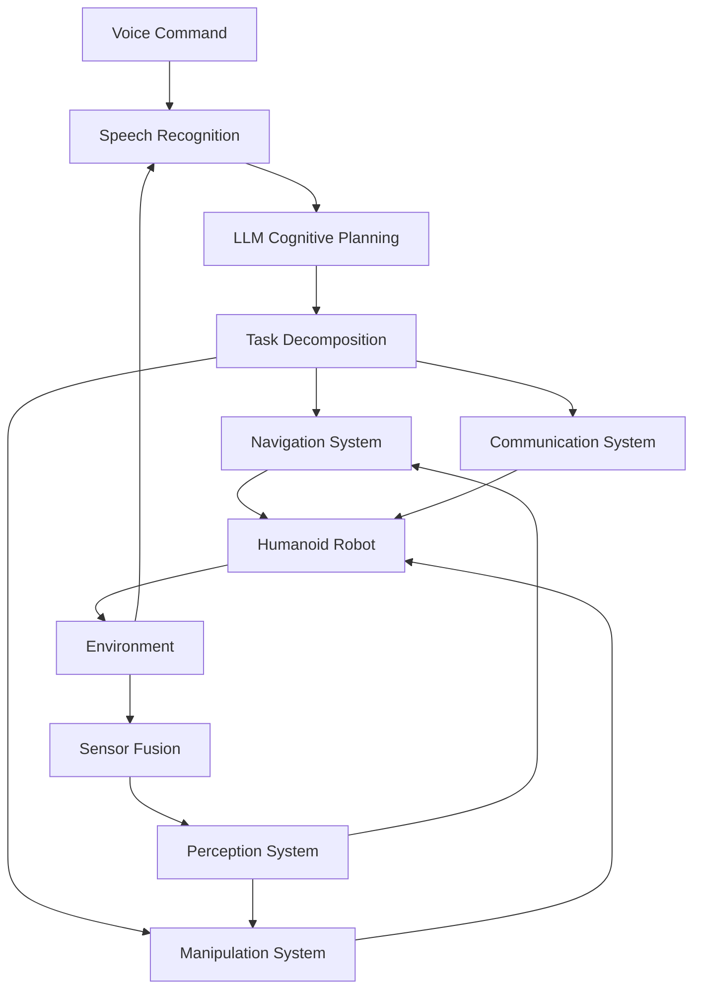

# Capstone Project: Autonomous Humanoid System

Capstone project تمام modules کو integrate کرتا ہے تاکہ ایک autonomous ہیومینوئڈ روبوٹ بنایا جا سکے جو voice commands وصول کر سکتا ہے، انہیں cognitively سمجھ سکتا ہے، اور حقیقی دنیا کے environments میں appropriate actions perform کر سکتا ہے۔

## سیکھنے کے مقاصد

اس capstone project کو مکمل کرنے کے بعد، آپ قابل ہوں گے:
- تمام چار modules کو ایک cohesive ہیومینوئڈ روبوٹ system میں انضمام کرنا
- Speech سے action تک end-to-end voice command processing لاگو کرنا
- Complete autonomous ہیومینوئڈ system deploy اور test کرنا
- System performance evaluate کرنا اور improvement areas identify کرنا

## Project Overview

Capstone project ملا دیتا ہے:
- **ماڈیول 1**: ROS 2 communication اور ہیومینوئڈ control
- **ماڈیول 2**: ڈیجیٹل ٹوئن simulation اور sensor integration
- **ماڈیول 3**: AI perception اور navigation systems
- **ماڈیول 4**: Voice-to-action اور cognitive planning

Final system "Please bring me the red cup from the kitchen" جیسے natural language commands accept کرے گا اور انہیں autonomously execute کرے گا۔

## System Architecture

### High-Level Architecture



### ROS 2 Package Structure

```
humanoid_robot_system/
├── voice_to_action/          # Module 4: Speech recognition
├── cognitive_planning/       # Module 4: LLM integration
├── navigation_system/        # Module 3: Isaac ROS Nav2
├── perception_system/        # Module 2: Sensor integration
├── robot_control/            # Module 1: ROS 2 nodes
└── system_integration/       # Capstone integration
```

## Implementation Steps

### Step 1: System Integration Node

```python
#!/usr/bin/env python3

import rclpy
from rclpy.node import Node
from std_msgs.msg import String
from geometry_msgs.msg import Pose
from sensor_msgs.msg import JointState
import json
import threading
import time

class HumanoidSystemIntegrator(Node):
    def __init__(self):
        super().__init__('humanoid_system_integrator')

        # Publishers for different subsystems
        self.voice_cmd_pub = self.create_publisher(String, '/voice_commands', 10)
        self.nav_goal_pub = self.create_publisher(Pose, '/navigation/goal', 10)
        self.manip_cmd_pub = self.create_publisher(String, '/manipulation/command', 10)
        self.robot_cmd_pub = self.create_publisher(JointState, '/joint_commands', 10)

        # Subscribers for system status
        self.voice_sub = self.create_subscription(
            String, '/voice_recognition/output', self.voice_callback, 10
        )
        self.planning_sub = self.create_subscription(
            String, '/cognitive_planning/output', self.planning_callback, 10
        )

        # System state
        self.system_state = {
            'current_task': None,
            'task_queue': [],
            'robot_status': 'idle',
            'navigation_status': 'idle',
            'voice_status': 'listening'
        }

    def voice_callback(self, msg):
        """Handle recognized voice commands"""
        try:
            command_data = json.loads(msg.data)
            command = command_data.get('command', '')
            
            # Send command to cognitive planning
            plan_msg = String()
            plan_msg.data = json.dumps({'command': command, 'context': self.get_system_context()})
            self.voice_cmd_pub.publish(plan_msg)
        except json.JSONDecodeError:
            self.get_logger().error('Invalid command format')

    def planning_callback(self, msg):
        """Handle cognitive planning output"""
        try:
            plan = json.loads(msg.data)
            if plan.get('success', False):
                self.execute_plan(plan)
        except json.JSONDecodeError:
            self.get_logger().error('Invalid plan format')

    def execute_plan(self, plan):
        """Execute the received plan"""
        for step in plan.get('steps', []):
            self.execute_step(step)
            self.wait_for_step_completion(step)

    def execute_step(self, step):
        """Execute a single step of the plan"""
        action = step.get('action', '')
        params = step.get('parameters', {})
        
        if action == 'navigate':
            self.execute_navigation_step(params)
        elif action == 'grasp':
            self.execute_grasp_step(params)
        elif action == 'place':
            self.execute_place_step(params)
        elif action == 'speak':
            self.execute_speak_step(params)

    def get_system_context(self):
        """Get current system context for planning"""
        return {
            'robot_location': 'current_location',
            'battery_level': 85,
            'environment_objects': ['cup', 'book', 'phone'],
            'robot_capabilities': ['navigation', 'manipulation', 'speech']
        }

def main(args=None):
    rclpy.init(args=args)
    node = HumanoidSystemIntegrator()
    try:
        rclpy.spin(node)
    except KeyboardInterrupt:
        pass
    finally:
        node.destroy_node()
        rclpy.shutdown()

if __name__ == '__main__':
    main()
```

## Testing اور Validation

### System Testing Checklist

1. **Voice Recognition**: Test مختلف commands اور environments
2. **Planning**: Verify complex commands کا proper decomposition
3. **Navigation**: Test path planning اور obstacle avoidance
4. **Manipulation**: Test object detection اور grasping
5. **Integration**: Test end-to-end command execution

## مشق

تمام modules کو integrate کرتے ہوئے ایک complete autonomous ہیومینوئڈ system بنائیں جو:
- Voice commands accept کرتا ہے
- Commands کو cognitive plans میں convert کرتا ہے
- Navigation اور manipulation perform کرتا ہے
- System status monitor کرتا ہے
- Errors handle کرتا ہے

## خلاصہ

Capstone project تمام modules کو ایک cohesive autonomous ہیومینوئڈ system میں integrate کرتا ہے۔ Proper integration اور testing intelligent روبوٹس بناتے ہیں جو complex natural language commands perform کر سکتے ہیں۔ یہ project تمام concepts کو practice میں لاتا ہے اور ایک complete system بناتا ہے۔

