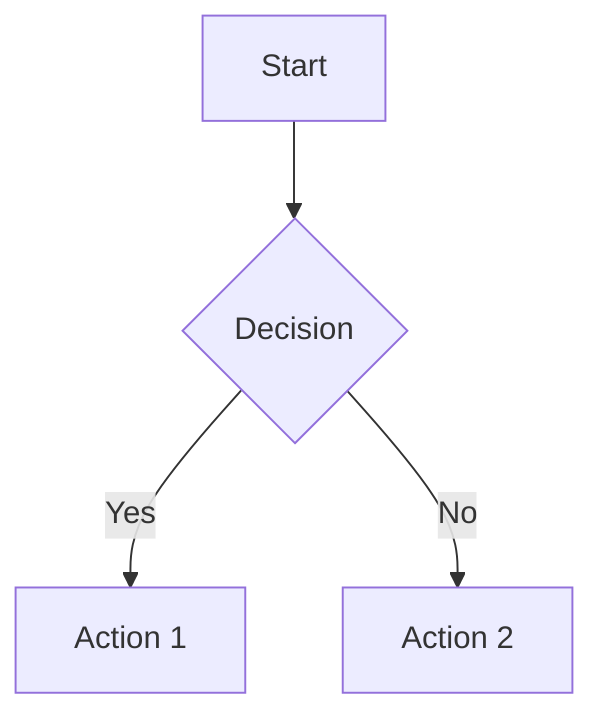

# Quickstart Guide: Physical AI & Humanoid Robotics Documentation

## Prerequisites
- Node.js 18 or higher
- npm or yarn package manager
- Git for version control
- GitHub account (for deployment)

## Getting Started

### 1. Clone the Repository
```bash
git clone <repository-url>
cd docusaurus
```

### 2. Install Dependencies
```bash
npm install
# or
yarn install
```

### 3. Start Local Development Server
```bash
npm run start
# or
yarn start
```
This will start a local development server at `http://localhost:3000` with hot reloading enabled.

### 4. Project Structure Overview
- `docs/` - Contains all documentation content in MDX format
- `src/` - Custom React components and pages
- `static/` - Static assets like images and downloadable files
- `docusaurus.config.js` - Main Docusaurus configuration
- `sidebars.js` - Navigation sidebar configuration

### 5. Adding New Content
To add a new page to the documentation:
1. Create a new `.mdx` file in the appropriate module directory under `docs/`
2. Add the page to the sidebar configuration in `sidebars.js`
3. Use frontmatter to specify metadata:
```md
---
title: Page Title
description: Brief description of the page content
tags: [tag1, tag2]
---

# Page Title

Content goes here...
```

### 6. Creating Diagrams with Mermaid
Use Mermaid syntax to create diagrams directly in your MDX files:


### 7. Building for Production
```bash
npm run build
# or
yarn build
```
This creates an optimized build in the `build/` directory.

### 8. Deploying to GitHub Pages
The repository is configured with GitHub Actions to automatically deploy to GitHub Pages when changes are pushed to the main branch. Ensure your `docusaurus.config.js` has the correct deployment settings:

```js
module.exports = {
  // ...
  deploymentBranch: 'gh-pages',
  // ...
};
```

## Key Features

### Accessibility
- All images must have descriptive alt text
- Semantic HTML structure
- Keyboard navigation support
- Screen reader compatibility

### Content Standards
- Each page should have clear learning objectives
- Code examples must include explanations
- Use inclusive language throughout
- Follow the logical progression from basic to advanced concepts

### Development Workflow
1. Create a new branch for your changes
2. Add or modify documentation content
3. Test locally with `npm run start`
4. Build and test with `npm run build`
5. Commit changes and create a pull request
6. Review and merge after approval

## Troubleshooting

### Common Issues
- **Page not showing in sidebar**: Check that the page is added to `sidebars.js`
- **Images not loading**: Ensure images are in the `static/img/` directory
- **Build errors**: Check for syntax errors in MDX files and frontmatter
- **Search not working**: Verify that search plugin is enabled in `docusaurus.config.js`